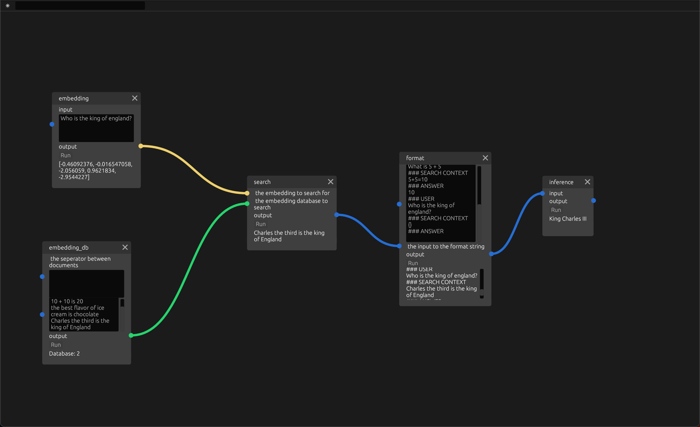

# Announcing Floneum: A Graph Editor for Local AI Workflows

We are thrilled to introduce Floneum, an intuitive graph editor designed specifically for local AI workflows. Floneum empowers users to effortlessly guide large language models and build structured workflows tailored to their specific use cases.

## What is Floneum?

Floneum is a user-friendly editor for visual AI workflows. Unlike existing tools that may have a high barrier to entry or allow limited control, Floneum provides a solution that is both easy to use and allows for greater customization.

For instance, while the chat GPT interface provides a straightforward entry point, it quickly becomes challenging to create structured workflows. Imagine wanting to search through files to find specific ones, such as all .txt files related to travel, and then upload them. With Floneum, you can achieve this seamlessly within a structured workflow, eliminating the need for manual interaction with external tools.

On the other end of the spectrum, tools like [Langchain](https://github.com/hwchase17/langchain) offer extensive workflow customization but come with more system requirements and potential security concerns. Langchain requires users to install tools like Python and CUDA, making it less accessible to non-developers. In addition to this, building workflows in Python code can be impractical for individuals without programming expertise. Finally, plugins in Langchain are not sandboxed, which can expose users to malware or security risks when incorporating third-party libraries.

Floneum is a single executable that runs models locally, eliminating the need for complex installations. The heart of Floneum is its graph-based editor, designed to enable users without programming knowledge to build and manage their AI workflows seamlessly.

## What Can You Build with Floneum?

While Floneum is still in the early stages of development, it already offers a range of built-in plugins that empower users to achieve their goals effectively. As of writing this post, the following plugins are available within Floneum:

- `embedding`
- `add_embedding`
- `embedding_db`
- `format`
- `generate_text`
- `generate_structured_text`
- `search`
- `search_engine`
- `if_statement`
- `contains`
- `write_to_file`
- `read_from_file`
- `python`

These plugins cover various functionalities, such as embedding data, generating text, searching through resources, and more. However, it's important to note that the capabilities of Floneum extend beyond these built-in plugins.

Floneum is designed to support an expanding ecosystem of plugins. In the future, additional plugins will be added to enhance its functionality further. Furthermore, if the built-in plugins don't precisely fit your application, Floneum allows you to extend its capabilities with plugins that are fully sandboxed within their own environment. Through the utilization of a WebAssembly (WASM) compiler, plugins can only access resources within their designated sandbox. This ensures that you can trust Floneum to prevent any malicious activity from impacting your computer.

## What's Next for Floneum?

We are excited about the future of Floneum and the upcoming features and improvements we have planned. Here are some of the things we plan to work on:

API based model integrations: We will be integrating with popular hosted AI models, including Chat GPT and more, to allow users to seamlessly incorporate these models into their Floneum workflows.

Improved Plugin System: We would like to continuously improve the plugin system as Floneum develops. Some of the improvements we are looking at includes introducing plugins as values, enabling more advanced control flow, and developing tutorials for writing plugins in additional languages.

Package Manager: In the future, we would like to introduce a package manager to simplify the process of discovering, installing, and managing plugins. This will enable users to easily extend Floneum's functionality and explore the ecosystem of community-contributed plugins.

Support for Other Model Types: In addition to language models, we have plans to expand Floneum's support to other model types, such as image generation, classification, and more. This will broaden the range of AI applications that can be built using Floneum.

We look forward to sharing these exciting updates with you as we continue to evolve Floneum. Stay tuned for more information and be part of the Floneum community as we shape the future of local AI workflows.

## Getting Started

To get started using Floneum, you can go to the [user documentation](https://floneum.com/docs/user/). If you are interested in developing plugins for Floneum, you start with the [developer documentation](https://floneum.com/docs/developer/).

Finally, if you are interested in Floneum, [join our discord community](https://discord.gg/dQdmhuB8q5)
