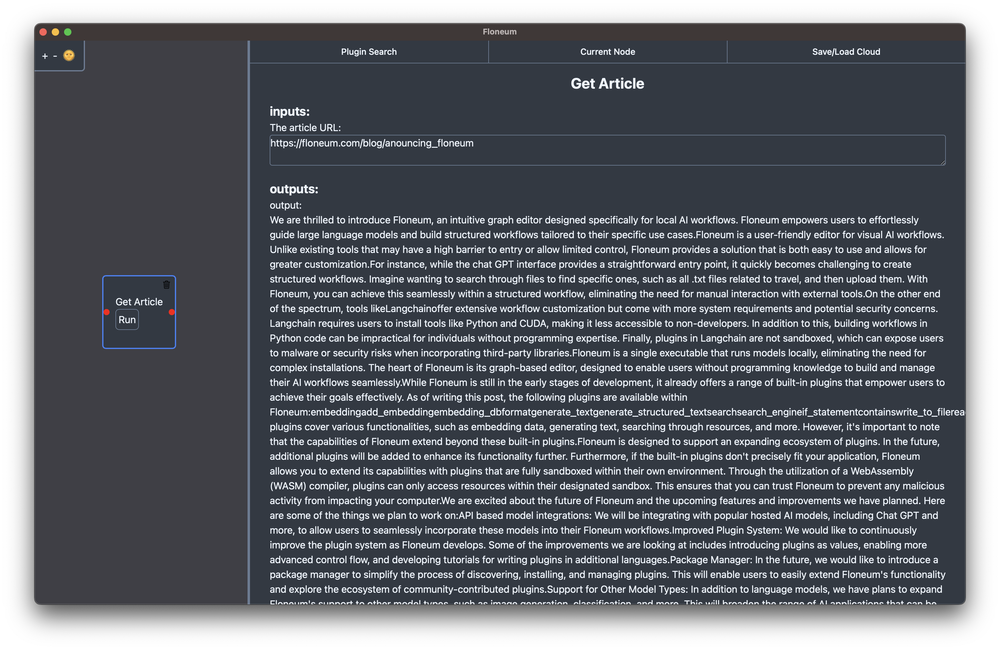
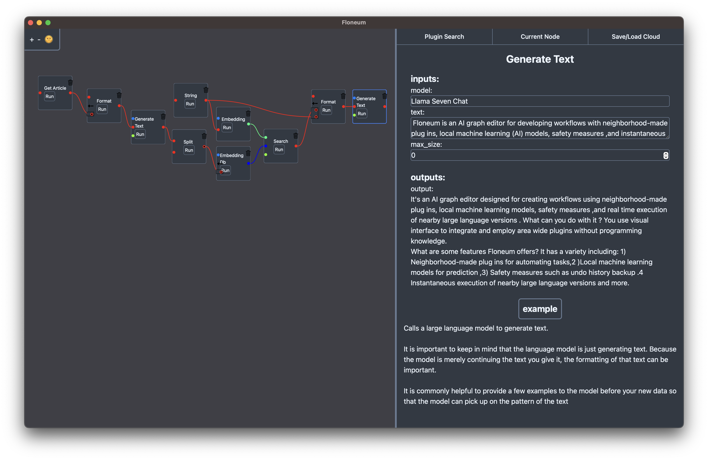

# Announcing Floneum 0.2

Floneum 0.2 is here with improvements on a range of issues from UI to web scraping to plugin distribution!

Before we dive into what is new, what exactly is Floneum? Floneum is a user-friendly visual editor for AI workflows packaged as an easy to install application with no external dependencies. It runs large language workflows entirely locally.

## What is new in 0.2?

### Rewritten UI!

The UI has been entirely rewritten for the 0.2 release. UI is now written in [Dioxus](https://github.com/DioxusLabs/dioxus) instead of EGUI. It also uses a completely custom graph system which gives us much more flexibility in terms of UI. Some types can now take any of many type of connection. For example, a list of strings can either take a single string, another list of strings or multiple lists/elements added together.

### Package Manger

When Floneum was originally released, it looked for plugins within a specific github repo which made it difficult for community made plugins to be distributed. The 0.2 release looks for any github repo with the tag `floneum` and a specific manifest generated by the CLI.

### New CLI

As part of the package manager, Floneum has a new CLI to make it easier to build and distribute plugins. You can build Floneum plugins by installing the Floneum CLI and running `floneum build`:

```sh
cargo install --git https://github.com/floneum/floneum floneum-cli
floneum build
```

### Improved Web Scraping

When the MVP of Floneum was released, it only contained plugins for reading from wikipedia and getting the raw (unreadable) HTML from a website. In the 0.4 release, we added a new `Get Article` plugin that allows you to read the main article from *any* URL.



### RSS Feed

Many websites have a RSS feed that allows you to read a list of recent articles. Floneum has a new built in RSS feed plugin that lets you read those articles to text:


### Headless Browser Support

Some websites requires you to interact with the page to get to content. Floneum plugins can now control a browser (or headless browser). This makes it possible for workflows built with Floneum to read much more content from web pages and even create new content on web pages:

```inject-dioxus
video {
    padding: "5px",
    controls: true,
    autoplay: true,
    muted: true,
    source {
        src: "../../assets/headless_browser.mp4",
        r#type: "video/mp4"
    }
}
```

### Nightly builds

If you want to keep up with the latest developments of Floneum, nightly builds are now created for [every release](https://github.com/floneum/floneum/actions/runs/6102318885).


- Sharing workflows on the cloud

Originally, Floneum plugins needed to be shared as a file copied from and to a specific directory. Now you can just save a workflow to the cloud, get an id, and load another user's workflow easily.

```inject-dioxus
div {
    class: "flex flex-row",
    video {
        padding: "5px",
        width: "50%",
        controls: true,
        autoplay: true,
        muted: true,
        source {
            src: "../../assets/save_cloud.mp4",
            r#type: "video/mp4"
        }
    }
    video {
        padding: "5px",
        width: "50%",
        controls: true,
        autoplay: true,
        muted: true,
        source {
            src: "../../assets/load_cloud.mp4",
            r#type: "video/mp4"
        }
    }
}
```

### Plugin Examples

Each plugin now has an example along side the documentation in the current node sidebar. You can click on the example to get a quick example of inputs and outputs for a specific node.


## What can you build?

### News feed summarization!


- Combining multiple models to create an efficient question answering workflow sources relevant to your use case!



### Automatic content creation with browser automation!

```inject-dioxus
video {
    padding: "5px",
    controls: true,
    autoplay: true,
    muted: true,
    source {
        src: "../../assets/headless_browsing_example.mp4",
        r#type: "video/mp4"
    }
}
```

## How do I get started?

To get started, just go to [the downloads page](https://github.com/floneum/floneum/releases/tag/v0.2.0), download the installer and create your first workflow (or try an example). That is it! No need to install python, or cuda!
